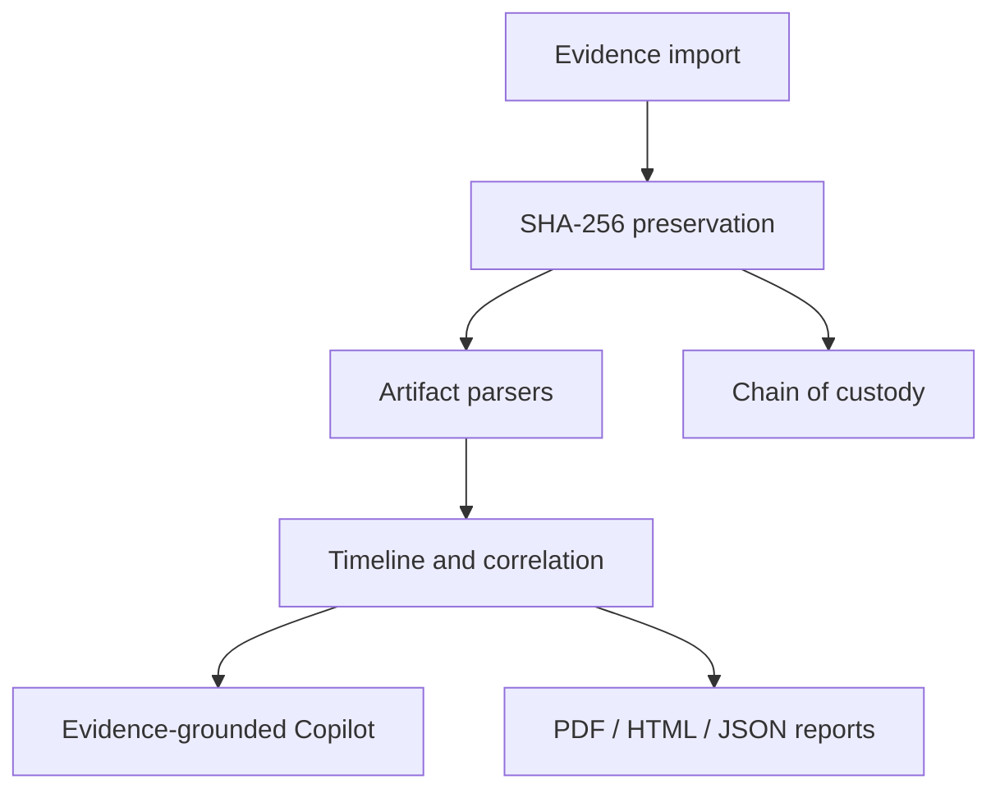

# Architecture

## Trust boundaries

- The desktop UI never edits original source files.
- The analysis engine operates on an integrity-checked case copy.
- SQLite stores artifact references, findings, and audit records.
- Offline Copilot uses only deterministic local case data.
- Groq is an optional outbound boundary and is disabled by default.

## Supported artifacts

- Basic file metadata for every imported file.
- Windows `.evtx` through `python-evtx`.
- JSON/JSONL and CSV event exports.
- Autopsy-style deleted-file CSV exports.
- Official YARA-X rule scanning through `yara-x`.
- Built-in indicator fallback only when YARA-X is unavailable.

Raw `.img`, `.raw`, and `.E01` files can be preserved and hashed. Deep
filesystem extraction should be performed through Autopsy or FTK Imager and
their export imported into DFIR Copilot; this keeps the desktop app reliable on
an 8 GB student laptop.
